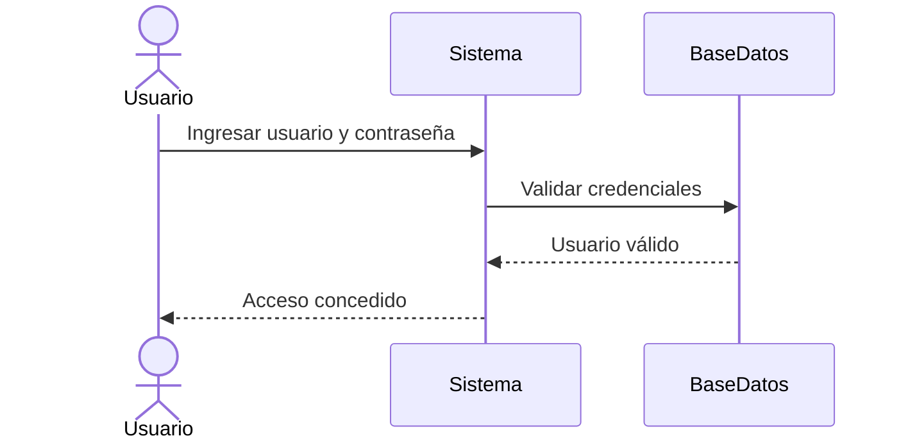
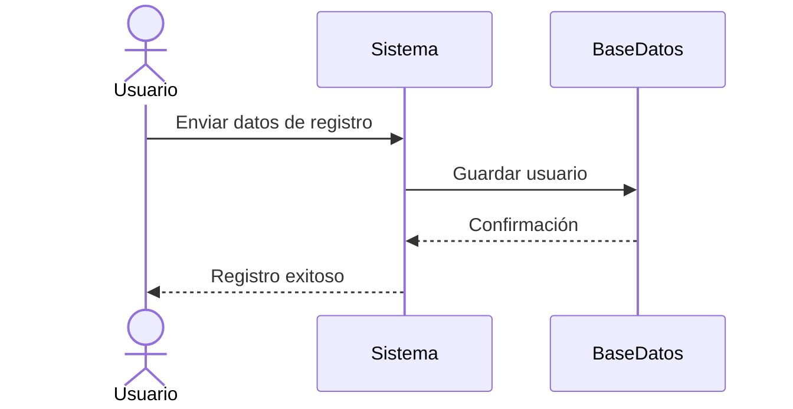
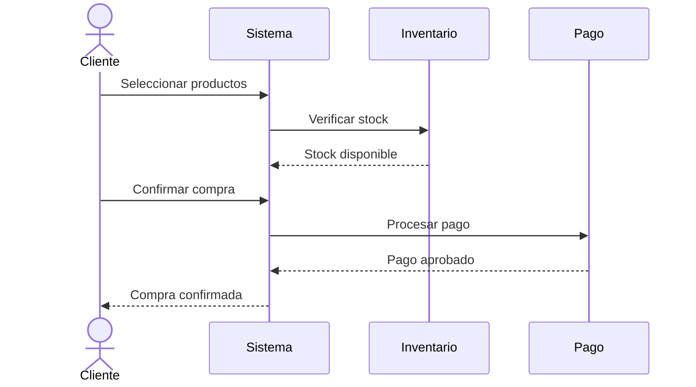
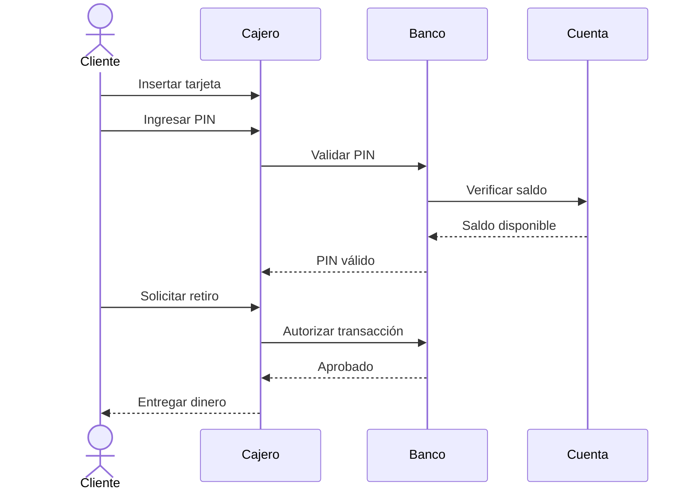
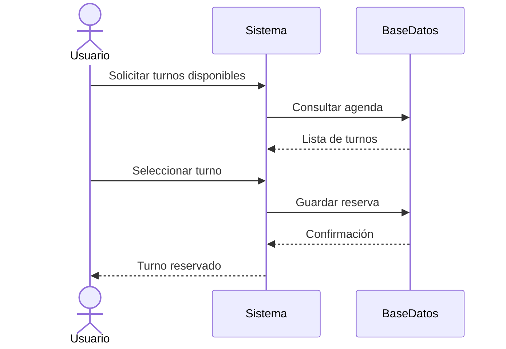
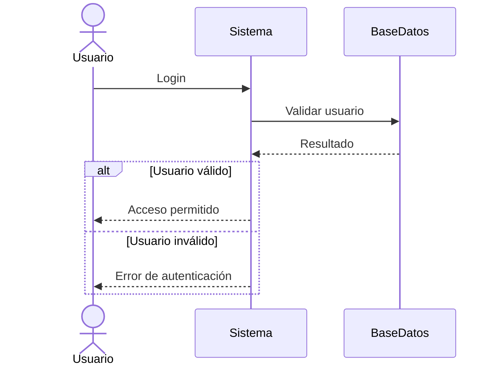
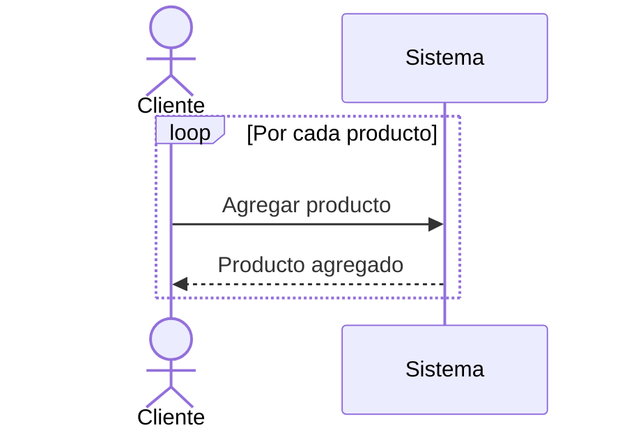
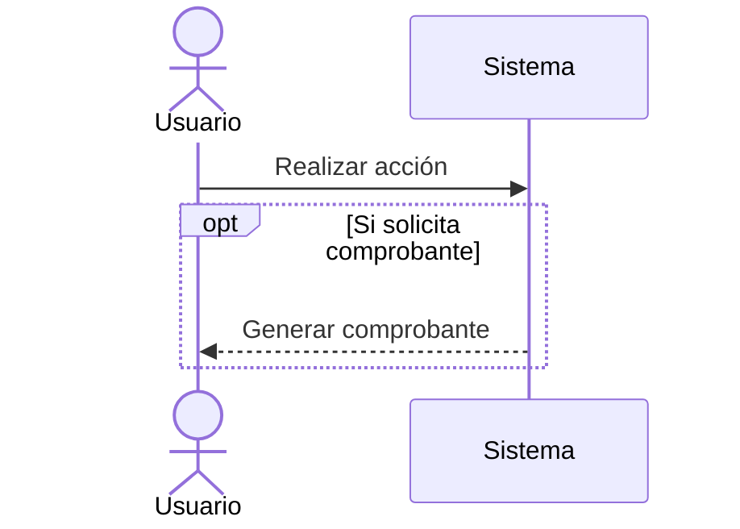
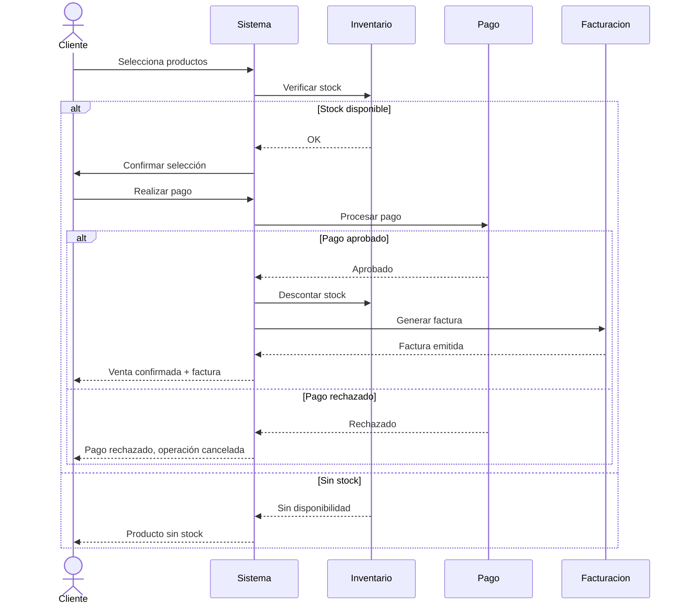

# Introducción a UML (Unified Modeling Language)

## ¿Qué es UML?

UML (Lenguaje Unificado de Modelado) es un estándar de la ingeniería de software que se utiliza para **representar, visualizar, especificar y documentar sistemas de software**.

No es un lenguaje de programación, sino un lenguaje de modelado visual.

Permite describir un sistema antes de construirlo, facilitando la comunicación entre desarrolladores, analistas y clientes.

---

## ¿Para qué sirve UML?

UML se utiliza principalmente para:

- Diseñar sistemas de software antes de implementarlos.
- Documentar sistemas existentes.
- Comunicar ideas entre equipos técnicos y no técnicos.
- Analizar requerimientos de un sistema.
- Reducir errores en el desarrollo.
- Mejorar la comprensión de sistemas complejos.

---

## Importancia de UML

UML es importante porque:

- Estandariza la forma de modelar sistemas.
- Permite entender sistemas complejos de manera visual.
- Mejora la comunicación entre equipos de desarrollo.
- Reduce ambigüedades en los requerimientos.
- Facilita el mantenimiento del software.
- Ayuda a planificar la arquitectura del sistema.

En proyectos grandes, UML es clave para evitar errores de diseño que luego son costosos de corregir.

---

## Tipos de diagramas UML

UML se divide en dos grandes grupos:

### 1. Diagramas Estructurales

Representan la **estructura estática** del sistema (cómo está compuesto).

Incluyen:

- Diagrama de Clases → estructura de clases y relaciones
- Diagrama de Objetos → instancias de clases en un momento dado
- Diagrama de Componentes → módulos del sistema
- Diagrama de Despliegue → infraestructura física
- Diagrama de Paquetes → organización del sistema
- Diagrama de Estructura Compuesta → estructura interna de un elemento

---

### 2. Diagramas de Comportamiento

Representan el **funcionamiento dinámico** del sistema (cómo se comporta).

Incluyen:

- Diagrama de Casos de Uso → funcionalidades del sistema
- Diagrama de Secuencia → interacción entre objetos en el tiempo
- Diagrama de Actividad → flujo de procesos
- Diagrama de Estados → estados de un objeto
- Diagrama de Comunicación → intercambio de mensajes
- Diagrama de Interacción General → visión global de interacciones
- Diagrama de Tiempos → comportamiento basado en tiempo

---

## Enfoque de los diagramas más importantes

### Diagrama de Casos de Uso
Describe qué hace el sistema desde el punto de vista del usuario.

---

### Diagrama de Clases
Representa la estructura del sistema (atributos, métodos y relaciones).

---

### Diagrama de Secuencia
Muestra cómo interactúan los objetos paso a paso en el tiempo.

---

### Diagrama de Actividad
Representa flujos de trabajo o procesos.

---

### Diagrama de Estados
Muestra cómo cambia el estado de un objeto según eventos.

---

## Relación entre diagramas

Un sistema normalmente se modela combinando varios diagramas:

- Casos de uso → definen funcionalidades
- Secuencia → detalla cómo se ejecutan
- Clases → define la estructura
- Actividad → describe procesos
- Estados → comportamiento de objetos específicos

---

## Ejemplo conceptual simple

### Caso de uso: Iniciar sesión

Se puede modelar así:

- Casos de uso: “Iniciar sesión”
- Secuencia: usuario → sistema → base de datos
- Clases: Usuario, AuthService, DB
- Actividad: validar credenciales
- Estado: usuario (no autenticado → autenticado)

---

## Beneficios de usar UML

✔ Mejora la comunicación del equipo  
✔ Reduce errores de diseño  
✔ Facilita el análisis de requerimientos  
✔ Permite documentar sistemas complejos  
✔ Ayuda en el diseño arquitectónico  
✔ Es estándar en la industria del software  

---

## Conclusión

UML es una herramienta fundamental en ingeniería de software porque permite representar sistemas de forma visual, estructurada y estándar.

Su uso facilita el diseño, análisis y documentación de cualquier sistema, desde aplicaciones pequeñas hasta sistemas empresariales complejos.

---
# Diagrama de Secuencia

## Introducción

Los diagramas de secuencia son un tipo de diagrama UML que permite representar cómo interactúan los distintos elementos de un sistema a lo largo del tiempo.

Su objetivo principal es mostrar:

- Quién participa en el proceso
- Qué mensajes se intercambian
- En qué orden ocurren
- Cómo evoluciona una interacción desde el inicio hasta el final

---

## ¿Qué representa un diagrama de secuencia?

Un diagrama de secuencia modela un escenario concreto (caso de uso), por ejemplo:

- Inicio de sesión
- Registro de usuario
- Compra de un producto
- Validación de pago

---

## Elementos principales

### 1. Actor
Es quien inicia la interacción (usuario o sistema externo).

Ejemplo: Cliente, Administrador.

---

### 2. Participante (Objeto o Sistema)
Es el componente interno del sistema que interviene.

Ejemplo: Sistema, API, Base de Datos.

---

### 3. Mensajes
Son las comunicaciones entre participantes.

---

### 4. Línea de vida
Representa el tiempo de vida del objeto (de arriba hacia abajo).

---

# Ejemplo 1: Inicio de sesión

## Descripción

Un usuario inicia sesión en el sistema ingresando credenciales.

## Diagrama

---

## Explicación

1. El usuario envía credenciales.
2. El sistema consulta la base de datos.
3. La base de datos valida.
4. El sistema responde al usuario.

---

# Ejemplo 2: Registro de usuario

## Descripción

Un usuario crea una cuenta en el sistema.

---

# Ejemplo 3: Compra de producto

## Descripción

Un cliente realiza una compra en una tienda online.

---

# Ejemplo 4: Cajero automático

## Descripción

Un cliente retira dinero de un cajero.

---

# Ejemplo 5: Reserva de turno

## Descripción

Un usuario reserva un turno en un sistema.

---

# Fragmentos combinados (estructuras de control)

## ALT (Condición IF / ELSE)

---

## LOOP (Repetición)

---

## OPT (Opcional)

---

# Cómo construir un diagrama de secuencia

## Paso 1: Identificar el caso de uso
Ejemplo: “Realizar compra”

## Paso 2: Identificar actores
Ejemplo: Cliente

## Paso 3: Identificar componentes
Ejemplo: Sistema, Pago, Inventario

## Paso 4: Definir mensajes
Ejemplo:
- seleccionar producto
- validar stock
- procesar pago

## Paso 5: Ordenar en el tiempo
De arriba hacia abajo

---

# Buenas prácticas

✔ Modelar un solo escenario por diagrama  
✔ Mantener mensajes claros y cortos  
✔ No mezclar niveles de abstracción  
✔ Usar ALT / LOOP cuando corresponda  
✔ Evitar sobrecargar con demasiados participantes  

---

# Errores comunes en Diagramas de Secuencia UML

## 1. Incluir demasiado detalle

Uno de los errores más frecuentes es sobrecargar el diagrama con información innecesaria.

### Problema
- Se incluyen detalles de implementación.
- Se representan métodos internos o lógica de código.
- El diagrama pierde claridad.

### Solución
- Mantener un nivel de abstracción alto.
- Mostrar solo interacciones relevantes entre participantes.

---

## 2. Mezclar niveles de abstracción

### Problema
- Combinar lógica de negocio con detalles técnicos.
- Mezclar frontend, backend y base de datos sin criterio.

### Solución
- Mantener consistencia en el nivel de detalle.
- Separar diagramas si es necesario.

---

## 3. Uso incorrecto de actores y objetos

### Problema
- Confundir actores externos con componentes internos.
- Representar mal los participantes del sistema.

### Solución
- Actor: externo al sistema.
- Objeto: parte interna del sistema.

---

## 4. Orden incorrecto de mensajes

### Problema
- Mensajes fuera de orden temporal.
- Flujo difícil de entender.

### Solución
- Representar siempre de arriba hacia abajo.
- Mantener coherencia en la secuencia.

---

## 5. Demasiados participantes

### Problema
- Diagramas saturados.
- Dificultad para entender el flujo.

### Solución
- Incluir solo los participantes necesarios.
- Dividir en varios diagramas si es necesario.

---

## 6. Mensajes poco claros

### Problema
- Nombres ambiguos como “procesar” o “hacer tarea”.

### Solución
- Usar verbos claros y específicos:
  - validarUsuario
  - calcularTotal
  - guardarPedido

---

## 7. Falta de mensajes de retorno

### Problema
- Solo se muestran solicitudes, no respuestas.

### Solución
- Incluir respuestas cuando sea relevante:
  - OK
  - Error
  - Datos devueltos

---

## 8. No usar fragmentos combinados

### Problema
- No representar decisiones o ciclos.

### Solución
- Utilizar:
  - `alt` → condiciones (if/else)
  - `loop` → repeticiones
  - `opt` → acciones opcionales

---

## 9. Representar lógica interna innecesaria

### Problema
- Mostrar cálculos internos o procesos técnicos detallados.

### Solución
- Enfocarse en interacciones entre objetos.
- No incluir implementación interna.

---

## 10. No alinearlo con el caso de uso

### Problema
- Diagramas que no representan el escenario real.

### Solución
- Derivar siempre el diagrama desde un caso de uso concreto.

---

## Resumen

Los errores más comunes en diagramas de secuencia están relacionados con:

- Exceso de detalle
- Mala definición de participantes
- Falta de claridad en los mensajes
- Desorden temporal
- No respetar el caso de uso

---

# Actividad práctica

## Caso: Sistema de ventas

Modelar el siguiente flujo:

1. Cliente selecciona productos
2. Sistema verifica stock
3. Cliente paga
4. Sistema valida pago
5. Sistema registra venta
6. Sistema descuenta stock
7. Sistema genera factura

### Consigna

Crear el diagrama de secuencia incluyendo:

- Actores
- Participantes
- Mensajes
- Posible caso alternativo (pago rechazado)

---

