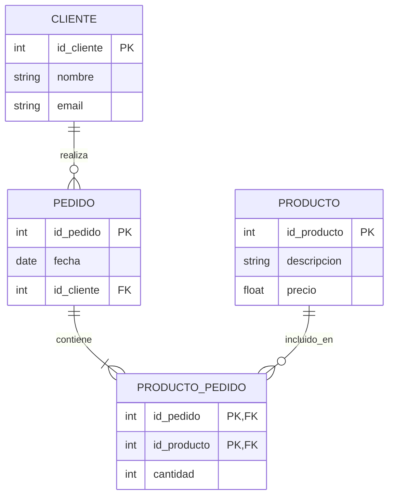

# Unidad 7: Modelado de Datos

En esta unidad abordaremos cómo estructurar y organizar la información dentro de un sistema, partiendo desde un diseño conceptual hasta llegar a un diseño lógico normalizado y listo para ser implementado en una base de datos.

## Diseño de datos dentro del desarrollo de un sistema

El diseño de datos tiene como objetivo determinar **qué información deberá almacenar el nuevo sistema, cómo se organizará y qué relaciones existirán entre los distintos datos**.

No debe pensarse la base de datos como un conjunto de tablas creadas directamente a partir de las pantallas del sistema. Antes de definir tablas es necesario comprender los **requerimientos**, las **reglas del negocio** y los objetos de información que intervienen en los procesos.

Por ejemplo, si entre los requerimientos del nuevo sistema aparecen las siguientes necesidades:

- Registrar clientes.
- Registrar productos.
- Registrar pedidos realizados por los clientes.
- Permitir que cada pedido contenga uno o más productos.
- Registrar la cantidad solicitada de cada producto.

A partir de estos requerimientos pueden comenzar a identificarse conceptos como `Cliente`, `Producto` y `Pedido`, junto con las relaciones que existen entre ellos.

El diseño de datos puede comprenderse en tres niveles:

1. **Diseño conceptual:** representa qué información existe y cómo se relaciona, sin preocuparse todavía por cómo será implementada en un motor de base de datos. El principal instrumento utilizado en esta etapa es el **Diagrama Entidad-Relación (DER)**.
2. **Diseño lógico:** transforma el modelo conceptual en tablas, campos, claves primarias y claves foráneas. En esta etapa se construye el **Modelo Relacional** y se analiza la **normalización**.
3. **Diseño físico:** corresponde a la implementación concreta en un motor de base de datos, por ejemplo MySQL, MariaDB, PostgreSQL o SQL Server. Aquí aparecen decisiones como tipos de datos específicos, índices, restricciones, nombres físicos, motores de almacenamiento, etc.

Para desarrollar correctamente el diseño de datos resulta fundamental comprender la relación entre **DER, Modelo Relacional, Normalización y Diccionario de Datos**, ya que estos elementos permiten pasar desde una representación conceptual de la información hasta una estructura lógica coherente y documentada.

### Relación con los requerimientos

El modelo de datos del nuevo sistema debe ser coherente con los requerimientos funcionales definidos previamente.

Esto significa que las entidades y tablas **no deben aparecer de manera arbitraria**. Debe poder explicarse por qué el sistema necesita almacenar cada conjunto de datos.

Ejemplo:

**Requerimiento funcional:**

> RF05: El sistema deberá permitir registrar pedidos realizados por los clientes, indicando los productos y cantidades solicitadas.

De este requerimiento pueden surgir, entre otras, las siguientes necesidades de datos:

- Identificar al cliente que realiza el pedido.
- Registrar la fecha del pedido.
- Identificar los productos incluidos.
- Registrar la cantidad de cada producto.

Por lo tanto, un posible modelo contendrá:

- `CLIENTE`
- `PEDIDO`
- `PRODUCTO`
- una relación entre `PEDIDO` y `PRODUCTO` que permita guardar la `cantidad`.

> **Importante:** los requerimientos indican **qué debe hacer el sistema**; el modelo de datos determina **qué información necesita almacenar el sistema para poder hacerlo**.

---


## a) Diagrama Entidad-Relación (DER)

El Modelo Entidad-Relación (DER) es una herramienta de modelado conceptual que permite representar gráficamente la estructura de los datos de una organización y cómo estos interactúan entre sí.

### Componentes del modelo

- **Entidades:** Representan objetos, personas o conceptos del mundo real sobre los cuales el sistema necesita guardar información (por ejemplo: `Cliente`, `Producto`, `Factura`). Se suelen graficar con rectángulos.
- **Atributos:** Son las propiedades o características que describen a una entidad. Por ejemplo, la entidad `Cliente` podría tener los atributos `DNI`, `Nombre` y `Teléfono`. Se representan típicamente con elipses.
  - **Clave Primaria (PK):** Es un atributo o conjunto de atributos que identifica de manera única a cada instancia de la entidad (ej: `DNI` para un cliente).
- **Relaciones:** Definen la asociación o interacción entre dos o más entidades (por ejemplo: un `Cliente` *realiza* un `Pedido`). Se representan mediante rombos.
- **Cardinalidad:** Indica el número de instancias de una entidad que pueden asociarse con instancias de otra entidad a través de una relación. Las más comunes son:
  - Uno a Uno (1:1)
  - Uno a Muchos (1:N)
  - Muchos a Muchos (N:M)

### ¿Cómo identificar entidades?

Una entidad suele representar algo acerca de lo cual el sistema necesita conservar información de manera independiente.

Al analizar una narrativa, entrevista o conjunto de requerimientos, es frecuente comenzar observando los **sustantivos** que aparecen. Sin embargo, no todo sustantivo debe convertirse automáticamente en una entidad.

Por ejemplo:

> "El cliente realiza un pedido. El pedido contiene productos. El vendedor consulta el pedido y registra el pago."

Posibles candidatos iniciales:

- Cliente
- Pedido
- Producto
- Vendedor
- Pago

Luego debe analizarse si el sistema realmente necesita almacenar información propia de cada uno.

Preguntas útiles para decidir si algo debe modelarse como entidad:

- ¿El sistema necesita registrar varias instancias de este elemento?
- ¿Cada instancia debe poder identificarse?
- ¿Tiene atributos propios?
- ¿Debe conservarse su información en el tiempo?
- ¿Se relaciona con otras entidades?
- ¿Aparece en uno o más requerimientos funcionales?

Por ejemplo, `Cliente` probablemente será una entidad porque existen muchos clientes y de cada uno interesa guardar datos como nombre, documento, teléfono o correo electrónico.

En cambio, un concepto como "pantalla de ventas" **no es una entidad del negocio**. Es una parte de la interfaz del sistema y no un objeto de información que deba modelarse necesariamente en el DER.

### Nombre de las entidades

Es conveniente utilizar nombres:

- En singular: `CLIENTE`, no `CLIENTES`.
- Claros y representativos del negocio.
- Sin ambigüedades.
- Consistentes en todo el proyecto.

Por ejemplo:

- `CLIENTE`
- `PRODUCTO`
- `PEDIDO`
- `PROVEEDOR`
- `PAGO`

Debe evitarse nombrar entidades de forma excesivamente técnica si el concepto puede expresarse mediante el vocabulario de la organización.

---

### Atributos

Los atributos describen las características que interesa almacenar de cada entidad.

Ejemplo:

`CLIENTE`

- `id_cliente`
- `dni`
- `nombre`
- `apellido`
- `telefono`
- `email`

No todos los datos imaginables de una persona deben incluirse. Solamente deben almacenarse aquellos que sean **necesarios para los requerimientos del sistema**.

Por ejemplo, si el sistema no utiliza el estado civil del cliente para ninguna funcionalidad, no tendría sentido incorporarlo simplemente porque es un dato que podría conocerse.

#### Tipos conceptuales de atributos

Los atributos pueden analizarse de distintas maneras:

- **Simples:** no necesitan descomponerse para el uso que les dará el sistema. Ejemplo: `precio`.
- **Compuestos:** conceptualmente pueden dividirse en partes. Por ejemplo, `domicilio` podría descomponerse en `calle`, `numero`, `localidad`, etc., si el sistema necesita trabajar con esas partes por separado.
- **Multivaluados:** pueden poseer varios valores para una misma entidad. Por ejemplo, si un cliente puede tener varios teléfonos, no conviene guardar `"3764..., 3765..."` en un único campo. Dependiendo de los requerimientos, podría ser necesario crear una estructura separada.
- **Derivados o calculados:** pueden obtenerse a partir de otros datos. Por ejemplo, `total_linea = cantidad × precio_unitario`.

Un atributo calculado **no siempre necesita almacenarse físicamente**. Debe analizarse si puede calcularse cada vez que sea requerido o si existen razones funcionales para conservarlo.

---

### Claves

Una **clave** permite identificar registros y establecer relaciones entre entidades o tablas.

#### Clave primaria (PK)

La **Clave Primaria o Primary Key (PK)** identifica de manera única cada instancia.

Ejemplo:

`CLIENTE`

| id_cliente | nombre |
| ---: | --- |
| 1 | Ana |
| 2 | Bruno |
| 3 | Carla |

En este caso, `id_cliente` permite distinguir inequívocamente cada cliente.

Una buena clave primaria debe ser:

- Única.
- No nula.
- Estable en el tiempo.
- Suficiente para identificar una instancia.

#### Clave natural y clave sustituta

Una **clave natural** utiliza un dato propio del negocio, por ejemplo `dni`.

Una **clave sustituta** o artificial es creada específicamente para identificar los registros, por ejemplo `id_cliente`.

Ejemplo:

```text
CLIENTE(
    id_cliente PK,
    dni,
    nombre,
    apellido
)
```

Aunque `dni` pueda ser único según las reglas del sistema, puede utilizarse `id_cliente` como clave primaria y definir `dni` con una restricción de unicidad.

En proyectos de sistemas es habitual utilizar identificadores artificiales porque simplifican las relaciones y evitan depender de datos del negocio que eventualmente podrían cambiar.

#### Clave compuesta

Una clave primaria también puede estar formada por más de un atributo.

Ejemplo:

```text
PRODUCTO_PEDIDO(
    id_pedido PK, FK,
    id_producto PK, FK,
    cantidad
)
```

La combinación:

```text
(id_pedido, id_producto)
```

identifica una fila de `PRODUCTO_PEDIDO`.

Esto significa que dentro del mismo pedido un mismo producto aparece como una única línea en este modelo.

> **Importante:** que dos campos sean claves foráneas no implica automáticamente que deban formar la clave primaria. La elección depende del modelo y de las reglas del negocio.

---

### Relaciones

Una relación representa una asociación significativa entre entidades.

Por ejemplo:

```text
CLIENTE realiza PEDIDO
```

La relación debe poder leerse como una oración con sentido dentro del dominio del problema.

Otros ejemplos:

```text
PROVEEDOR suministra PRODUCTO
EMPLEADO registra VENTA
CLIENTE efectúa PAGO
VENTA contiene PRODUCTO
```

Es conveniente utilizar verbos que describan claramente la relación.

---

### Cardinalidad y participación

La cardinalidad no solamente indica si una relación es `1:1`, `1:N` o `N:M`; también es importante comprender **cuántas ocurrencias como mínimo y como máximo** pueden intervenir.

Por ejemplo:

> Un cliente puede realizar cero, uno o muchos pedidos.  
> Cada pedido debe pertenecer a un único cliente.

Puede expresarse conceptualmente como:

```text
CLIENTE 1 ------ N PEDIDO
```

Pero una lectura más precisa considera:

- Para un `CLIENTE`: puede haber **0..N** `PEDIDO`.
- Para un `PEDIDO`: debe haber **1..1** `CLIENTE`.

La cardinalidad debe leerse **en ambos sentidos**.

#### Relación 1:1

Ejemplo:

> Cada empleado posee como máximo una ficha de datos de acceso y cada ficha corresponde a un único empleado.

```text
EMPLEADO 1 ------ 1 CREDENCIAL
```

Las relaciones 1:1 deben analizarse cuidadosamente, porque a veces ambas estructuras podrían pertenecer a una misma entidad. Se mantienen separadas cuando existe una razón conceptual, funcional o de seguridad para hacerlo.

#### Relación 1:N

Ejemplo:

> Un cliente puede realizar muchos pedidos y cada pedido pertenece a un único cliente.

```text
CLIENTE 1 ------ N PEDIDO
```

Este es uno de los tipos de relación más frecuentes.

#### Relación N:M

Ejemplo:

> Un pedido puede contener muchos productos y un producto puede aparecer en muchos pedidos.

```text
PEDIDO N ------ M PRODUCTO
```

Conceptualmente, esta relación es válida en el DER. Al pasar al modelo relacional deberá resolverse mediante una tabla intermedia.

---

### Cómo determinar la cardinalidad

No debe elegirse una cardinalidad porque "parezca lógica". Debe surgir de las **reglas del negocio**.

Para determinarla, conviene formular preguntas concretas.

Ejemplo entre `CLIENTE` y `PEDIDO`:

1. ¿Un cliente puede realizar más de un pedido?  
   Sí.
2. ¿Un pedido puede pertenecer a más de un cliente?  
   No.

Resultado:

```text
CLIENTE 1:N PEDIDO
```

Ejemplo entre `PRODUCTO` y `PROVEEDOR`:

1. ¿Un proveedor puede suministrar muchos productos?  
   Sí.
2. ¿Un mismo producto puede ser suministrado por varios proveedores?  
   Si la organización responde que sí, entonces:

```text
PROVEEDOR N:M PRODUCTO
```

Pero si la organización trabaja con un único proveedor asignado a cada producto, la cardinalidad podría ser:

```text
PROVEEDOR 1:N PRODUCTO
```

> **Conclusión:** dos sistemas aparentemente similares pueden tener modelos diferentes porque sus reglas de negocio son diferentes.

---

### Entidad asociativa

Una relación N:M suele dar origen, al pasar al modelo relacional, a una **entidad o tabla asociativa**.

Ejemplo:

```text
PEDIDO N:M PRODUCTO
```

Se resuelve mediante:

```text
PRODUCTO_PEDIDO
```

Además, la relación puede poseer atributos propios.

Por ejemplo, la `cantidad` no pertenece solamente a `PEDIDO` ni solamente a `PRODUCTO`.

Supongamos:

- Pedido 100 incluye 3 unidades del Producto A.
- Pedido 101 incluye 8 unidades del Producto A.

La cantidad depende de **qué producto se encuentra en qué pedido**.

Por eso:

```text
PRODUCTO_PEDIDO(
    id_pedido,
    id_producto,
    cantidad
)
```

La entidad asociativa puede contener otros atributos, por ejemplo:

- `precio_unitario`
- `descuento`
- `observacion`

si esos datos corresponden específicamente a esa relación.

---

### Diferencia entre DER y base de datos

El DER **no es simplemente una captura de las tablas de la base de datos**.

El DER representa conceptualmente:

- Entidades.
- Atributos relevantes.
- Relaciones.
- Cardinalidades.
- Reglas estructurales del dominio.

La base de datos implementada, en cambio, puede incorporar además:

- campos técnicos;
- marcas de fecha y hora;
- identificadores internos;
- índices;
- columnas de auditoría;
- campos para borrado lógico;
- restricciones específicas del motor.

Por ejemplo, un framework podría agregar:

```text
created_at
updated_at
deleted_at
```

Estos campos pueden existir físicamente sin que necesariamente sean los elementos centrales del DER conceptual.

El DER debe representar **el modelo de datos del sistema desarrollado** y mantener coherencia con la estructura de datos que finalmente se implemente.

---

### Procedimiento práctico para construir un DER

Puede seguirse la siguiente secuencia:

1. Revisar los requerimientos funcionales.
2. Identificar la información que el sistema necesita conservar.
3. Proponer entidades candidatas.
4. Determinar los atributos de cada entidad.
5. Elegir las claves primarias.
6. Identificar relaciones entre entidades.
7. Formular las reglas del negocio que justifican cada relación.
8. Determinar cardinalidades y opcionalidad.
9. Resolver ambigüedades.
10. Revisar que el modelo permita satisfacer los requerimientos.
11. Verificar que no existan entidades duplicadas o atributos ubicados en entidades incorrectas.

#### Ejemplo breve

Requerimientos:

- Registrar proveedores.
- Registrar productos.
- Permitir asociar varios proveedores a un producto.
- Registrar el precio de compra que cada proveedor ofrece para cada producto.

Entidades principales:

```text
PROVEEDOR
PRODUCTO
```

Regla:

```text
Un proveedor puede ofrecer muchos productos.
Un producto puede ser ofrecido por muchos proveedores.
```

Relación:

```text
PROVEEDOR N:M PRODUCTO
```

Como el `precio_compra` depende de la combinación proveedor-producto, aparece una entidad asociativa:

```text
PROVEEDOR_PRODUCTO(
    id_proveedor,
    id_producto,
    precio_compra
)
```

---


## b) Modelo Relacional Básico

Una vez definido el modelo conceptual (DER), el siguiente paso en el diseño de sistemas es traducirlo a un diseño lógico. El **Modelo Relacional** es el enfoque más utilizado y es la base de las bases de datos relacionales modernas (SQL).

### Transformación del DER

El proceso de conversión del DER al Modelo Relacional sigue reglas precisas:
- Cada **Entidad** se transforma en una **Tabla** (o Relación).
- Cada **Atributo** de la entidad se convierte en una **Columna** (o Campo) de la tabla.
- Cada instancia o registro de la entidad se convierte en una **Fila** (o Tupla).

### Tablas y Relaciones entre tablas

En el modelo relacional, las asociaciones no se grafican con líneas simplemente, sino que se implementan mediante el uso de claves foráneas:
- **Relaciones 1:N:** Se implementan tomando la Clave Primaria de la tabla del lado "1" y colocándola como **Clave Foránea (FK)** en la tabla del lado "Muchos (N)".
- **Relaciones N:M:** El modelo relacional no soporta relaciones de muchos a muchos directamente. Para resolverlo, se debe crear una **Tabla Intermedia** (o asociativa) que contenga, como mínimo, las claves primarias de las dos tablas que se están relacionando.


### Conceptos fundamentales del modelo relacional

En el modelo relacional se utilizan los siguientes conceptos:

- **Tabla o relación:** conjunto de datos de una misma estructura.
- **Fila, registro o tupla:** una instancia concreta almacenada en una tabla.
- **Columna, campo o atributo:** una propiedad que se almacena para cada registro.
- **Clave primaria (PK):** identifica un registro de manera única.
- **Clave foránea (FK):** referencia la clave primaria —o una clave candidata válida— de otra tabla y permite establecer la relación.
- **Valor nulo (`NULL`):** indica ausencia de valor cuando el modelo permite que un dato sea opcional.
- **Restricción de unicidad (`UNIQUE`):** impide que un valor que debe ser único se repita.

Ejemplo:

```text
CLIENTE(
    id_cliente PK,
    dni UNIQUE,
    nombre,
    apellido,
    email
)
```

---

### Integridad referencial

Una clave foránea no es solamente un campo con un nombre parecido al identificador de otra tabla. Debe representar una referencia válida.

Ejemplo:

```text
PEDIDO(
    id_pedido PK,
    fecha,
    id_cliente FK -> CLIENTE.id_cliente
)
```

Si `id_cliente = 25` aparece en un pedido, debe existir el cliente 25 en la tabla `CLIENTE`, salvo que el diseño admita temporalmente otro comportamiento por una razón explícita.

Esta propiedad se denomina **integridad referencial**.

Su objetivo es evitar situaciones incoherentes, por ejemplo:

- Un pedido asociado a un cliente inexistente.
- Un detalle asociado a un producto inexistente.
- Un pago asociado a una venta inexistente.

---

### Reglas de transformación del DER al Modelo Relacional

#### Regla 1: entidad → tabla

DER:

```text
CLIENTE
- id_cliente
- nombre
- email
```

Modelo relacional:

```text
CLIENTE(
    id_cliente PK,
    nombre,
    email
)
```

#### Regla 2: relación 1:N

DER:

```text
CLIENTE 1 ------ N PEDIDO
```

Modelo relacional:

```text
CLIENTE(
    id_cliente PK,
    nombre
)

PEDIDO(
    id_pedido PK,
    fecha,
    id_cliente FK -> CLIENTE.id_cliente
)
```

La FK se coloca en el lado **N**.

Una forma útil de recordarlo es:

> En una relación 1:N, el registro del lado "muchos" necesita saber a cuál registro del lado "uno" pertenece.

#### Regla 3: relación N:M

DER:

```text
PEDIDO N ------ M PRODUCTO
```

No debe implementarse de esta forma:

```text
PEDIDO(
    id_pedido,
    productos = "3,5,8"
)
```

Tampoco:

```text
PRODUCTO(
    id_producto,
    pedidos = "10,12,15"
)
```

La solución es una tabla asociativa:

```text
PRODUCTO_PEDIDO(
    id_pedido PK, FK -> PEDIDO.id_pedido,
    id_producto PK, FK -> PRODUCTO.id_producto,
    cantidad
)
```

Así, cada fila representa una asociación concreta.

Ejemplo:

| id_pedido | id_producto | cantidad |
| ---: | ---: | ---: |
| 100 | 5 | 2 |
| 100 | 9 | 1 |
| 101 | 5 | 4 |

Lectura:

- El pedido 100 contiene 2 unidades del producto 5.
- El pedido 100 contiene 1 unidad del producto 9.
- El pedido 101 contiene 4 unidades del producto 5.

#### Regla 4: relación 1:1

Una relación 1:1 puede implementarse colocando una FK en una de las tablas y garantizando que esa FK no pueda repetirse.

Ejemplo conceptual:

```text
EMPLEADO 1 ------ 1 CREDENCIAL
```

Posible modelo:

```text
EMPLEADO(
    id_empleado PK,
    nombre
)

CREDENCIAL(
    id_credencial PK,
    id_empleado FK UNIQUE -> EMPLEADO.id_empleado,
    usuario
)
```

La restricción `UNIQUE` sobre `id_empleado` evita que un empleado tenga múltiples credenciales dentro de esta regla de negocio.

---

### Modelo relacional expresado de forma textual

Para documentar un modelo relacional puede utilizarse una notación compacta:

```text
CLIENTE(
    id_cliente PK,
    dni,
    nombre,
    apellido,
    email
)

PEDIDO(
    id_pedido PK,
    fecha,
    estado,
    id_cliente FK -> CLIENTE.id_cliente
)

PRODUCTO(
    id_producto PK,
    descripcion,
    precio
)

PRODUCTO_PEDIDO(
    id_pedido PK, FK -> PEDIDO.id_pedido,
    id_producto PK, FK -> PRODUCTO.id_producto,
    cantidad
)
```

Esta representación permite identificar rápidamente:

- Nombre de cada tabla.
- Campos.
- PK.
- FK.
- Tabla y campo referenciados.

Al documentar un Modelo Relacional, cada tabla debe indicar como mínimo esos elementos.

También puede complementarse con una tabla descriptiva:

| Tabla | Clave primaria | Claves foráneas | Propósito |
| --- | --- | --- | --- |
| `CLIENTE` | `id_cliente` | — | Almacena los clientes |
| `PEDIDO` | `id_pedido` | `id_cliente` | Almacena los pedidos |
| `PRODUCTO` | `id_producto` | — | Almacena los productos |
| `PRODUCTO_PEDIDO` | `id_pedido`, `id_producto` | `id_pedido`, `id_producto` | Almacena los productos incluidos en cada pedido |

---

### Tipos de datos

Al construir el modelo lógico y, especialmente, al preparar su implementación física, cada campo debe poseer un tipo de dato apropiado.

Ejemplos frecuentes:

- `INTEGER` / `BIGINT`: identificadores y cantidades enteras.
- `VARCHAR(n)`: textos de longitud limitada.
- `TEXT`: textos extensos.
- `DATE`: fechas.
- `TIME`: horas.
- `DATETIME` / `TIMESTAMP`: fecha y hora.
- `DECIMAL(p,s)`: importes monetarios o valores que requieren precisión decimal.
- `BOOLEAN`: verdadero/falso.

Ejemplo:

```text
PRODUCTO(
    id_producto INTEGER PK,
    descripcion VARCHAR(150),
    precio DECIMAL(12,2)
)
```

Para importes monetarios conviene evitar tipos de punto flotante como `FLOAT` cuando se requiere precisión exacta.

> **Importante:** los tipos exactos y sus nombres pueden variar según el motor de base de datos utilizado. En el modelo lógico interesa principalmente definir correctamente la naturaleza del dato.

---

### Campos obligatorios y opcionales

No todos los campos necesariamente tienen un valor en todas las filas.

Ejemplo:

```text
CLIENTE
- id_cliente: obligatorio
- nombre: obligatorio
- telefono: opcional
```

En la implementación, un campo obligatorio suele expresarse mediante `NOT NULL`.

La decisión debe surgir de las reglas del sistema.

Por ejemplo:

> Para registrar un cliente, el sistema exige nombre y documento, pero el teléfono es opcional.

Entonces esa regla debe reflejarse de manera consistente en:

- Requerimientos.
- Validaciones del sistema.
- Modelo de datos.
- Base de datos.

---

### Errores frecuentes al construir el modelo relacional

#### Guardar listas dentro de un campo

Incorrecto:

```text
PEDIDO(
    id_pedido,
    productos = "Mouse, Teclado, Monitor"
)
```

Problemas:

- dificulta buscar;
- dificulta relacionar;
- dificulta actualizar;
- no permite aplicar integridad referencial;
- viola la atomicidad esperada por 1FN.

#### Repetir grupos de columnas

Incorrecto:

```text
PEDIDO(
    id_pedido,
    producto_1,
    cantidad_1,
    producto_2,
    cantidad_2,
    producto_3,
    cantidad_3
)
```

Problemas:

- limita artificialmente la cantidad de productos;
- genera columnas vacías;
- obliga a modificar la estructura cuando aumenta el máximo;
- dificulta consultas.

Solución:

```text
PRODUCTO_PEDIDO(
    id_pedido,
    id_producto,
    cantidad
)
```

#### Copiar información innecesariamente

Supongamos:

```text
PEDIDO(
    id_pedido,
    id_cliente,
    nombre_cliente,
    telefono_cliente
)
```

Si `nombre_cliente` y `telefono_cliente` ya pertenecen a `CLIENTE`, repetirlos en cada pedido puede producir inconsistencias.

Por ejemplo, si cambia el teléfono del cliente, podrían existir pedidos con diferentes versiones del teléfono sin que esa diferencia haya sido intencional.

> Esto no significa que nunca pueda almacenarse información histórica. Si el negocio necesita conservar los datos exactos utilizados en una operación, esa decisión debe estar justificada como una regla del sistema y modelarse conscientemente.

---


## c) Normalización hasta 3FN

La normalización es un proceso sistemático mediante el cual se revisa la estructura de las tablas creadas para minimizar la redundancia y evitar problemas (anomalías) al momento de insertar, actualizar o borrar datos.

### Eliminación de redundancias

El objetivo de la normalización es asegurar que "cada dato no clave se almacene en un solo lugar". Esto garantiza la consistencia de la información y optimiza el almacenamiento.

### Tercera Forma Normal (3FN)

El proceso de normalización se realiza por etapas o "Formas Normales". En el alcance de la materia llegaremos hasta la Tercera Forma Normal (3FN):

1. **Primera Forma Normal (1FN):**
   - Asegura la atomicidad: Todos los atributos deben ser indivisibles.
   - Elimina los grupos repetitivos o atributos multivaluados (no puede haber una columna que guarde una lista de valores separados por comas).

2. **Segunda Forma Normal (2FN):**
   - La tabla debe estar en 1FN.
   - Todos los atributos no clave deben depender por completo de la Clave Primaria. Si la tabla tiene una clave primaria compuesta, ningún atributo puede depender de solo una parte de esa clave.

3. **Tercera Forma Normal (3FN):**
   - La tabla debe estar en 2FN.
   - **No deben existir dependencias transitivas.** Esto significa que un atributo no clave no puede depender de otro atributo no clave. Todo campo debe depender exclusivamente de la clave primaria.

> **💡 Regla práctica:** Para que una tabla esté normalizada en 3FN, cada atributo debe depender *"de la clave, de toda la clave y de nada más que de la clave"*.


### ¿Por qué normalizar?

Una tabla puede "funcionar" y aun así estar mal diseñada.

La normalización busca evitar principalmente tres tipos de anomalías:

#### Anomalía de actualización

Supongamos una tabla:

| id_pedido | cliente | telefono_cliente | producto | cantidad |
| ---: | --- | --- | --- | ---: |
| 1 | Ana López | 1111 | Mouse | 2 |
| 2 | Ana López | 1111 | Teclado | 1 |
| 3 | Ana López | 1111 | Monitor | 1 |

Si Ana cambia su teléfono, hay que modificar varias filas.

Si se actualizan dos filas pero se olvida la tercera, el sistema queda con información contradictoria.

#### Anomalía de inserción

Si los datos del cliente solamente existen dentro de los pedidos, podría resultar imposible registrar un cliente que todavía no realizó ninguno.

#### Anomalía de eliminación

Si se elimina el último pedido de un cliente y toda la información del cliente estaba guardada únicamente en esa fila, también se perderían sus datos.

La normalización separa los datos según sus dependencias para reducir estos problemas.

---

### Dependencia funcional

Para comprender 2FN y 3FN es importante entender la idea de **dependencia funcional**.

Se dice que un atributo `B` depende funcionalmente de `A` cuando un valor de `A` determina un único valor de `B`.

Se puede escribir:

```text
A -> B
```

Ejemplo:

```text
id_cliente -> nombre_cliente
```

Para un determinado `id_cliente`, existe un determinado `nombre_cliente`.

Otro ejemplo:

```text
id_producto -> descripcion_producto
id_producto -> precio_actual
```

En una tabla de detalle cuya clave es compuesta:

```text
(id_pedido, id_producto) -> cantidad
```

La `cantidad` depende de la combinación pedido-producto.

---

### Primera Forma Normal (1FN) en detalle

Para cumplir 1FN:

- Cada celda debe contener un valor atómico para el uso que realizará el sistema.
- No deben existir listas almacenadas en una sola columna.
- No deben existir grupos repetitivos como `producto1`, `producto2`, `producto3`.
- Cada fila debe poder identificarse.

#### Ejemplo que no cumple 1FN

```text
PEDIDO(
    id_pedido,
    cliente,
    productos
)
```

Datos:

| id_pedido | cliente | productos |
| ---: | --- | --- |
| 1 | Ana | Mouse, Teclado, Monitor |

El campo `productos` contiene varios valores.

Una primera reorganización podría producir filas separadas:

| id_pedido | cliente | producto |
| ---: | --- | --- |
| 1 | Ana | Mouse |
| 1 | Ana | Teclado |
| 1 | Ana | Monitor |

Ahora cada celda contiene un único valor, aunque todavía será necesario analizar 2FN y 3FN.

---

### Segunda Forma Normal (2FN) en detalle

2FN resulta especialmente importante cuando existe una **clave primaria compuesta**.

Supongamos:

```text
DETALLE_PEDIDO(
    id_pedido PK,
    id_producto PK,
    fecha_pedido,
    descripcion_producto,
    cantidad
)
```

Clave primaria:

```text
(id_pedido, id_producto)
```

Analicemos las dependencias:

```text
id_pedido -> fecha_pedido
id_producto -> descripcion_producto
(id_pedido, id_producto) -> cantidad
```

Problema:

- `fecha_pedido` depende solamente de `id_pedido`.
- `descripcion_producto` depende solamente de `id_producto`.
- Solo `cantidad` depende de toda la clave compuesta.

Por lo tanto, la tabla no está correctamente en 2FN.

Debe separarse:

```text
PEDIDO(
    id_pedido PK,
    fecha_pedido
)

PRODUCTO(
    id_producto PK,
    descripcion_producto
)

DETALLE_PEDIDO(
    id_pedido PK, FK,
    id_producto PK, FK,
    cantidad
)
```

Ahora:

```text
id_pedido -> fecha_pedido
id_producto -> descripcion_producto
(id_pedido, id_producto) -> cantidad
```

y cada atributo se encuentra en la tabla cuya clave lo determina correctamente.

> **Regla práctica de 2FN:** si la PK es compuesta, verificar que ningún campo no clave dependa solamente de una parte de esa PK.

Si la tabla posee una clave primaria simple, una dependencia parcial respecto de la PK no puede existir de la misma manera; aun así, debe continuarse el análisis de 3FN.

---

### Tercera Forma Normal (3FN) en detalle

En 3FN se buscan **dependencias transitivas**.

Supongamos:

```text
CLIENTE(
    id_cliente PK,
    nombre_cliente,
    id_localidad,
    nombre_localidad,
    codigo_postal
)
```

Dependencias:

```text
id_cliente -> id_localidad
id_localidad -> nombre_localidad
id_localidad -> codigo_postal
```

Por lo tanto:

```text
id_cliente -> id_localidad -> nombre_localidad
```

`nombre_localidad` no depende directamente del cliente como concepto; depende de `id_localidad`.

Existe una dependencia transitiva.

Una posible solución es:

```text
LOCALIDAD(
    id_localidad PK,
    nombre_localidad,
    codigo_postal
)

CLIENTE(
    id_cliente PK,
    nombre_cliente,
    id_localidad FK -> LOCALIDAD.id_localidad
)
```

Ahora los datos de la localidad se almacenan una sola vez y los clientes la referencian.

---

### Ejemplo completo de normalización: desde una estructura problemática hasta 3FN

Supongamos que inicialmente se plantea almacenar una venta de esta manera:

```text
VENTA_GENERAL(
    id_venta,
    fecha,
    id_cliente,
    nombre_cliente,
    telefono_cliente,
    id_vendedor,
    nombre_vendedor,
    id_producto,
    descripcion_producto,
    precio_producto,
    cantidad
)
```

Una venta con tres productos generaría tres filas y repetiría:

- fecha;
- cliente;
- teléfono del cliente;
- vendedor;
- nombre del vendedor.

Además, la descripción del producto se repetiría en todas las ventas donde aparezca.

#### Paso 1: identificar dependencias

Podríamos tener:

```text
id_venta -> fecha, id_cliente, id_vendedor
id_cliente -> nombre_cliente, telefono_cliente
id_vendedor -> nombre_vendedor
id_producto -> descripcion_producto
(id_venta, id_producto) -> cantidad
```

El `precio_producto` requiere una consideración adicional.

Si representa el **precio actual del producto**, dependería de `id_producto`.

Pero si representa el **precio aplicado en el momento de la venta**, puede ser correcto almacenarlo en el detalle porque una misma mercadería pudo venderse a precios distintos en diferentes ventas.

En ese caso:

```text
(id_venta, id_producto) -> precio_unitario_aplicado
```

Este ejemplo demuestra que la normalización no consiste únicamente en "separar tablas": es necesario comprender el **significado de cada dato**.

#### Paso 2: separar entidades y dependencias

Resultado posible:

```text
CLIENTE(
    id_cliente PK,
    nombre_cliente,
    telefono_cliente
)

VENDEDOR(
    id_vendedor PK,
    nombre_vendedor
)

PRODUCTO(
    id_producto PK,
    descripcion_producto
)

VENTA(
    id_venta PK,
    fecha,
    id_cliente FK -> CLIENTE.id_cliente,
    id_vendedor FK -> VENDEDOR.id_vendedor
)

DETALLE_VENTA(
    id_venta PK, FK -> VENTA.id_venta,
    id_producto PK, FK -> PRODUCTO.id_producto,
    cantidad,
    precio_unitario_aplicado
)
```

#### Paso 3: verificar 1FN

- No existen listas de productos dentro de una columna.
- Cada atributo contiene un valor individual.
- No existen grupos como `producto1`, `producto2`, etc.

Cumple 1FN.

#### Paso 4: verificar 2FN

En `DETALLE_VENTA` la clave primaria es compuesta:

```text
(id_venta, id_producto)
```

Los campos:

```text
cantidad
precio_unitario_aplicado
```

dependen de la combinación completa que representa una línea de venta.

Los datos propios de la venta están en `VENTA` y los propios del producto en `PRODUCTO`.

Cumple 2FN.

#### Paso 5: verificar 3FN

En cada tabla, los atributos no clave dependen de la clave correspondiente y no de otro atributo no clave:

```text
id_cliente -> nombre_cliente, telefono_cliente
id_vendedor -> nombre_vendedor
id_producto -> descripcion_producto
id_venta -> fecha, id_cliente, id_vendedor
(id_venta, id_producto) -> cantidad, precio_unitario_aplicado
```

No se observan dependencias transitivas dentro de las tablas planteadas.

Cumple 3FN para las dependencias analizadas.

---

### Cómo justificar la normalización

No alcanza con escribir:

> "La base de datos se encuentra normalizada hasta 3FN."

La afirmación debe poder explicarse.

Una justificación breve pero correcta podría ser:

> **1FN:** todas las tablas poseen atributos atómicos y no contienen grupos repetitivos ni listas de valores en un mismo campo.  
> **2FN:** los atributos no clave dependen de la totalidad de su clave primaria. En las tablas con claves compuestas, como `PRODUCTO_PEDIDO`, los atributos propios de la relación dependen de la combinación completa de sus claves.  
> **3FN:** no existen atributos no clave que dependan de otros atributos no clave; la información correspondiente a conceptos independientes se almacena en sus propias tablas y se relaciona mediante claves foráneas.

Sin embargo, además de esta explicación general, conviene utilizar **uno o más ejemplos concretos del propio modelo**.

Ejemplo:

> En `PRODUCTO_PEDIDO`, `cantidad` depende de la combinación `id_pedido + id_producto`, no solamente de una de las partes. Los datos descriptivos del producto se almacenan en `PRODUCTO`, mientras que los datos propios del pedido se almacenan en `PEDIDO`. De esta manera se evitan dependencias parciales.

---

### Normalización no significa dividir todo indiscriminadamente

Crear una tabla para cada campo no implica un mejor diseño.

La separación debe responder a:

- entidades reales;
- dependencias funcionales;
- relaciones;
- reglas del negocio;
- necesidad de evitar redundancias problemáticas.

Por ejemplo:

```text
CLIENTE(
    id_cliente,
    nombre,
    apellido
)
```

No sería razonable crear:

```text
NOMBRE_CLIENTE(...)
APELLIDO_CLIENTE(...)
```

simplemente para "normalizar más".

La normalización es una herramienta para obtener una estructura coherente, no una competencia por crear la mayor cantidad posible de tablas.

---

### Datos históricos y aparente redundancia

Existen situaciones en las que almacenar un dato que también aparece en otra tabla puede ser intencional.

Ejemplo:

```text
PRODUCTO(
    id_producto,
    precio_actual
)
```

y:

```text
DETALLE_VENTA(
    id_venta,
    id_producto,
    cantidad,
    precio_unitario_aplicado
)
```

Aunque ambos campos representen precios, **no significan lo mismo**:

- `precio_actual`: precio vigente del producto.
- `precio_unitario_aplicado`: precio realmente utilizado en una venta histórica.

Si mañana cambia `precio_actual`, no debe modificarse el precio con el que se realizó una venta anterior.

Por eso, antes de considerar que existe redundancia, hay que analizar la **semántica del dato**.

---


## d) Ejemplo

A continuación, se presenta un Modelo Entidad-Relación (DER) diseñado con sintaxis Mermaid. Este ejemplo ilustra los conceptos de Entidades, Atributos, Relaciones y cómo se resuelven las cardinalidades utilizando Claves Primarias (PK) y Foráneas (FK).



### Análisis del Ejemplo:

1. **Relación 1:N (Uno a Muchos):** 
   - Un `CLIENTE` puede realizar varios `PEDIDO`s, pero un pedido pertenece a un solo cliente. 
   - **Solución Relacional:** La clave primaria `id_cliente` pasa como Clave Foránea (FK) a la tabla `PEDIDO`.
2. **Relación N:M (Muchos a Muchos):** 
   - Un `PEDIDO` puede tener varios `PRODUCTO`s, y un `PRODUCTO` puede estar en varios `PEDIDO`s.
   - **Solución Relacional:** Se crea la tabla intermedia `PRODUCTO_PEDIDO`. Esta tabla asocia ambas entidades y tiene una clave primaria compuesta por las claves de las tablas originales (`id_pedido` y `id_producto`), que también actúan como claves foráneas. Además, almacena atributos propios de la relación, como la `cantidad`.

---

## e) Diccionario de Datos del Modelo

El **Diccionario de Datos** documenta de manera precisa la estructura de los datos utilizados por el sistema.

Mientras el DER ofrece una visión gráfica y el modelo relacional muestra tablas y claves, el diccionario permite responder preguntas como:

- ¿Qué significa exactamente este campo?
- ¿Qué tipo de dato almacena?
- ¿Es obligatorio?
- ¿Es PK o FK?
- ¿Qué valores admite?
- ¿A qué tabla referencia?
- ¿Qué regla del negocio se aplica sobre él?

El diccionario evita interpretaciones ambiguas y permite que otra persona pueda comprender la estructura sin tener que deducir el significado observando solamente el código o la base de datos.

### Contenido mínimo

Como estructura mínima, el diccionario puede documentarse de la siguiente manera:

| Campo | Tipo de dato | Descripción |
| --- | --- | --- |
| `id_cliente` | INTEGER | Identificador único del cliente |
| `nombre` | VARCHAR(100) | Nombre del cliente |
| `email` | VARCHAR(150) | Correo electrónico del cliente |

Sin embargo, cuando resulte necesario, es recomendable agregar información adicional.

### Formato ampliado recomendado

| Tabla | Campo | Tipo | PK | FK | Nulo | Descripción / Regla |
| --- | --- | --- | :---: | :---: | :---: | --- |
| `CLIENTE` | `id_cliente` | INTEGER | Sí | No | No | Identificador único del cliente |
| `CLIENTE` | `nombre` | VARCHAR(100) | No | No | No | Nombre del cliente |
| `CLIENTE` | `email` | VARCHAR(150) | No | No | Sí | Correo electrónico de contacto |
| `PEDIDO` | `id_pedido` | INTEGER | Sí | No | No | Identificador único del pedido |
| `PEDIDO` | `fecha` | DATE | No | No | No | Fecha en que se registró el pedido |
| `PEDIDO` | `id_cliente` | INTEGER | No | Sí | No | Cliente que realizó el pedido |

Este formato ampliado no reemplaza la necesidad de describir claramente el modelo, pero facilita su lectura.

---

### Cómo redactar una buena descripción de campo

Descripción insuficiente:

```text
Campo: fecha
Descripción: fecha
```

La descripción repite el nombre y no aporta información.

Mejor:

```text
Campo: fecha
Descripción: Fecha en que fue registrado el pedido.
```

Otro ejemplo:

```text
Campo: estado
Descripción: Estado actual del pedido. Valores permitidos: PENDIENTE, CONFIRMADO, CANCELADO.
```

Otro:

```text
Campo: id_cliente
Descripción: Identificador del cliente que realizó el pedido. Referencia a CLIENTE.id_cliente.
```

La descripción debe permitir comprender el significado del dato **dentro del sistema**.

---

### Diccionario de Datos del ejemplo CLIENTE–PEDIDO–PRODUCTO

#### Tabla `CLIENTE`

| Campo | Tipo de dato | Descripción |
| --- | --- | --- |
| `id_cliente` | INTEGER | Identificador único del cliente. Clave primaria. |
| `nombre` | VARCHAR(100) | Nombre del cliente. |
| `email` | VARCHAR(150) | Correo electrónico del cliente. |

#### Tabla `PEDIDO`

| Campo | Tipo de dato | Descripción |
| --- | --- | --- |
| `id_pedido` | INTEGER | Identificador único del pedido. Clave primaria. |
| `fecha` | DATE | Fecha en la que se registra el pedido. |
| `id_cliente` | INTEGER | Cliente que realiza el pedido. Clave foránea que referencia `CLIENTE.id_cliente`. |

#### Tabla `PRODUCTO`

| Campo | Tipo de dato | Descripción |
| --- | --- | --- |
| `id_producto` | INTEGER | Identificador único del producto. Clave primaria. |
| `descripcion` | VARCHAR(150) | Nombre o descripción del producto. |
| `precio` | DECIMAL(12,2) | Precio vigente del producto. |

#### Tabla `PRODUCTO_PEDIDO`

| Campo | Tipo de dato | Descripción |
| --- | --- | --- |
| `id_pedido` | INTEGER | Pedido al cual pertenece la línea. Forma parte de la PK y referencia `PEDIDO.id_pedido`. |
| `id_producto` | INTEGER | Producto incluido en el pedido. Forma parte de la PK y referencia `PRODUCTO.id_producto`. |
| `cantidad` | INTEGER | Cantidad del producto solicitada en ese pedido. Debe ser mayor que cero. |

---

## f) Desarrollo completo de la sección Diseño de Datos

Para documentar correctamente el diseño de datos de un proyecto puede utilizarse la siguiente secuencia.

### 1. Construir el DER

El DER debe mostrar:

- Entidades del nuevo sistema.
- Atributos relevantes.
- PK.
- Relaciones.
- Cardinalidades.

Para cada relación debe poder expresarse una regla de negocio.

Ejemplo:

```text
Un CLIENTE puede realizar cero o muchos PEDIDOS.
Cada PEDIDO pertenece a un único CLIENTE.

Un PEDIDO debe contener uno o más PRODUCTOS.
Un PRODUCTO puede aparecer en cero o muchos PEDIDOS.
```

Estas reglas justifican:

```text
CLIENTE 1:N PEDIDO
PEDIDO N:M PRODUCTO
```

---

### 2. Transformar el DER al Modelo Relacional

Partiendo del DER:

```text
CLIENTE 1:N PEDIDO
PEDIDO N:M PRODUCTO
```

Resultado:

```text
CLIENTE(
    id_cliente PK,
    nombre,
    email
)

PEDIDO(
    id_pedido PK,
    fecha,
    id_cliente FK -> CLIENTE.id_cliente
)

PRODUCTO(
    id_producto PK,
    descripcion,
    precio
)

PRODUCTO_PEDIDO(
    id_pedido PK, FK -> PEDIDO.id_pedido,
    id_producto PK, FK -> PRODUCTO.id_producto,
    cantidad
)
```

---

### 3. Verificar la normalización

#### 1FN

- No existen listas dentro de campos.
- Los valores son atómicos.
- Los productos de un pedido no se guardan en columnas repetidas.

#### 2FN

La tabla `PRODUCTO_PEDIDO` tiene una clave compuesta:

```text
(id_pedido, id_producto)
```

`cantidad` depende de la combinación completa:

```text
(id_pedido, id_producto) -> cantidad
```

La descripción y precio del producto no se guardan en esta tabla porque dependen de `id_producto` y se encuentran en `PRODUCTO`.

La fecha del pedido no se guarda en `PRODUCTO_PEDIDO` porque depende de `id_pedido` y se encuentra en `PEDIDO`.

#### 3FN

- En `CLIENTE`, nombre y email dependen de `id_cliente`.
- En `PEDIDO`, fecha e id_cliente dependen de `id_pedido`.
- En `PRODUCTO`, descripción y precio dependen de `id_producto`.
- En `PRODUCTO_PEDIDO`, cantidad depende de la clave compuesta.
- No se incorporan datos no clave que dependan de otros campos no clave.

Por lo tanto, para las dependencias consideradas en este ejemplo, el diseño se encuentra normalizado hasta 3FN.

---

### 4. Elaborar el Diccionario de Datos

Cada campo utilizado en el modelo debe documentarse.

No deben aparecer en el diccionario campos que no existen en el modelo ni deberían existir campos importantes del modelo sin documentar.

La documentación debe coincidir con la base de datos implementada.

---

## g) Coherencia entre DER, Modelo Relacional, Diccionario y Base de Datos

Las distintas representaciones no son trabajos independientes.

Deben describir **el mismo sistema de datos**.

Por ejemplo, si en el DER existe:

```text
CLIENTE 1:N PEDIDO
```

entonces en el Modelo Relacional debería existir una implementación compatible, por ejemplo:

```text
PEDIDO.id_cliente FK -> CLIENTE.id_cliente
```

Si `id_cliente` aparece en el modelo relacional, también debe estar documentado en el diccionario.

Y si el sistema finalmente fue implementado, la base de datos debería contener la estructura correspondiente.

### Ejemplo de inconsistencia

DER:

```text
CLIENTE 1:N PEDIDO
```

Modelo relacional:

```text
PEDIDO(
    id_pedido,
    fecha
)
```

Problema: no existe ninguna FK que permita saber qué cliente realizó el pedido.

Otro caso:

Modelo relacional:

```text
PRODUCTO(
    id_producto,
    descripcion,
    precio,
    id_categoria
)
```

pero el DER no contiene `CATEGORIA` y el diccionario tampoco explica `id_categoria`.

Esto indica que la documentación no representa el mismo diseño.

> **Regla fundamental:** DER, modelo relacional, normalización, diccionario de datos y base implementada deben ser distintas vistas de una misma estructura.

---

## h) Errores frecuentes en Diseño de Datos

### 1. Construir el DER copiando directamente la base ya programada

El DER debe expresar el modelo del dominio y debe poder justificarse desde los requerimientos.

### 2. Confundir entidad con actor

Un actor del sistema no necesariamente es una entidad.

Por ejemplo, `Cliente` puede ser actor y entidad si utiliza el sistema y además se almacenan sus datos.

Pero un servicio externo utilizado únicamente para consultar una cotización podría ser un actor o sistema externo sin que necesariamente exista una entidad equivalente con el mismo nombre.

### 3. Confundir una acción con una entidad

`Registrar venta` es una funcionalidad o proceso.

`VENTA` puede ser una entidad.

### 4. Crear una entidad para cada pantalla

Las pantallas pertenecen al diseño de interfaz. Las entidades representan información.

Una pantalla "Gestión de clientes" puede utilizar `CLIENTE`, `DOMICILIO`, `LOCALIDAD` y otras tablas sin que exista una tabla `GESTION_CLIENTES`.

### 5. Omitir cardinalidades

Una línea sin cardinalidad no explica suficientemente la regla de negocio.

Debe poder determinarse si la asociación es 1:1, 1:N o N:M y, cuando corresponda, su participación mínima.

### 6. No resolver relaciones N:M en el modelo relacional

Una relación N:M conceptual debe convertirse en una tabla intermedia.

### 7. Utilizar el mismo campo para varios datos

Ejemplo incorrecto:

```text
contacto = "Juan Pérez - 3764... - juan@email.com"
```

Si nombre, teléfono y email deben ser procesados individualmente, deben representarse como datos separados.

### 8. Guardar datos que pueden producir inconsistencias sin justificación

Ejemplo:

```text
PEDIDO(
    id_cliente,
    nombre_cliente
)
```

Si el nombre pertenece a `CLIENTE`, repetirlo en `PEDIDO` debe tener una razón histórica o funcional concreta; de lo contrario, introduce redundancia innecesaria.

### 9. Confundir PK con FK

- PK: identifica la fila dentro de su propia tabla.
- FK: referencia un registro de otra tabla.

Un mismo campo puede ser simultáneamente parte de una PK y una FK, como ocurre frecuentemente en tablas asociativas.

### 10. Decir que una base está en 3FN sin justificarlo

La normalización debe demostrarse mediante el análisis de dependencias y ejemplos del propio modelo.

### 11. Diseñar datos sin considerar las reglas del negocio

La cardinalidad y la estructura no pueden decidirse únicamente por intuición técnica.

Preguntas como estas pueden modificar completamente el modelo:

- ¿Un producto puede tener más de un proveedor?
- ¿Una venta puede tener más de un medio de pago?
- ¿Un cliente puede poseer varias direcciones?
- ¿Un turno puede asignarse a más de un profesional?
- ¿Un pedido puede existir sin cliente registrado?
- ¿Se necesita conservar el precio histórico?

---

## i) Lista de verificación para Diseño de Datos

Antes de dar por finalizada esta parte del proyecto, verificar:

### DER

- [ ] Las entidades corresponden al nuevo sistema.
- [ ] Las entidades surgen de necesidades reales de información.
- [ ] Cada entidad posee atributos suficientes para comprenderla.
- [ ] Se identifican las claves primarias.
- [ ] Las relaciones están correctamente identificadas.
- [ ] Las cardinalidades pueden justificarse mediante reglas del negocio.
- [ ] Las relaciones N:M fueron identificadas correctamente.
- [ ] El DER permite representar la información necesaria para los requerimientos funcionales.

### Modelo Relacional

- [ ] Cada entidad fue transformada correctamente en una tabla cuando corresponde.
- [ ] Se indican los campos.
- [ ] Se indican las claves primarias.
- [ ] Se indican las claves foráneas.
- [ ] Las FK se encuentran en el lado correcto de las relaciones 1:N.
- [ ] Las relaciones N:M se resolvieron mediante tablas asociativas.
- [ ] Las tablas asociativas incluyen los atributos propios de la relación.
- [ ] No se almacenan listas de identificadores en un único campo.

### Normalización

- [ ] Los campos son atómicos para el uso del sistema.
- [ ] No existen grupos repetitivos.
- [ ] Se revisó 1FN.
- [ ] En tablas con PK compuesta se verificaron dependencias parciales.
- [ ] Se revisó 2FN.
- [ ] Se verificó que no existan dependencias transitivas no justificadas.
- [ ] Se revisó 3FN.
- [ ] La justificación utiliza ejemplos concretos del modelo desarrollado.

### Diccionario de Datos

- [ ] Se documentan todos los campos relevantes.
- [ ] Se indica el tipo de dato.
- [ ] La descripción explica el significado y no solamente repite el nombre.
- [ ] Las PK y FK pueden identificarse.
- [ ] Las referencias entre tablas están documentadas.
- [ ] Las reglas importantes de obligatoriedad o valores permitidos se indican cuando corresponde.

### Coherencia general

- [ ] El DER corresponde a los requerimientos del nuevo sistema.
- [ ] El Modelo Relacional representa el DER.
- [ ] El Diccionario de Datos representa el Modelo Relacional.
- [ ] La base de datos implementada coincide con la documentación.
- [ ] No existen tablas o relaciones importantes en la implementación que estén ausentes en el diseño.
- [ ] No existen elementos documentados que finalmente no formen parte del sistema, salvo que se indique expresamente que fueron descartados.

---

## j) Ejercicio integrador

Analizar el siguiente escenario:

> Una organización necesita registrar clientes y productos. Los clientes realizan pedidos. Cada pedido puede contener varios productos y debe registrarse la cantidad de cada uno. Los productos pertenecen a una categoría. Una categoría puede agrupar muchos productos. De cada cliente se registra nombre, documento y correo electrónico. De cada producto se registra descripción y precio. De cada pedido se registra fecha y estado.

### Actividades

1. Identificar las entidades.
2. Definir los atributos de cada entidad.
3. Elegir las claves primarias.
4. Identificar las relaciones.
5. Determinar las cardinalidades.
6. Elaborar el DER.
7. Transformar el DER al Modelo Relacional.
8. Identificar PK y FK.
9. Verificar 1FN, 2FN y 3FN.
10. Elaborar el Diccionario de Datos.

### Posible resolución

Entidades:

```text
CLIENTE
PEDIDO
PRODUCTO
CATEGORIA
PRODUCTO_PEDIDO
```

Reglas:

```text
Un CLIENTE puede realizar muchos PEDIDOS.
Cada PEDIDO pertenece a un CLIENTE.

Una CATEGORIA puede contener muchos PRODUCTOS.
Cada PRODUCTO pertenece a una CATEGORIA.

Un PEDIDO contiene uno o más PRODUCTOS.
Un PRODUCTO puede estar incluido en muchos PEDIDOS.
```

Modelo relacional:

```text
CLIENTE(
    id_cliente PK,
    documento,
    nombre,
    email
)

CATEGORIA(
    id_categoria PK,
    nombre
)

PRODUCTO(
    id_producto PK,
    descripcion,
    precio,
    id_categoria FK -> CATEGORIA.id_categoria
)

PEDIDO(
    id_pedido PK,
    fecha,
    estado,
    id_cliente FK -> CLIENTE.id_cliente
)

PRODUCTO_PEDIDO(
    id_pedido PK, FK -> PEDIDO.id_pedido,
    id_producto PK, FK -> PRODUCTO.id_producto,
    cantidad
)
```

Dependencias principales:

```text
id_cliente -> documento, nombre, email
id_categoria -> nombre
id_producto -> descripcion, precio, id_categoria
id_pedido -> fecha, estado, id_cliente
(id_pedido, id_producto) -> cantidad
```

Con estas dependencias puede analizarse que:

- no existen listas o grupos repetitivos;
- `cantidad` depende de toda la clave compuesta de `PRODUCTO_PEDIDO`;
- los datos de categoría se encuentran separados de `PRODUCTO`;
- los datos del cliente se encuentran separados de `PEDIDO`;
- no se observan, para las dependencias planteadas, atributos no clave que dependan de otros atributos no clave dentro de una misma tabla.

Por lo tanto, el modelo presentado puede justificarse hasta 3FN para el escenario planteado.

