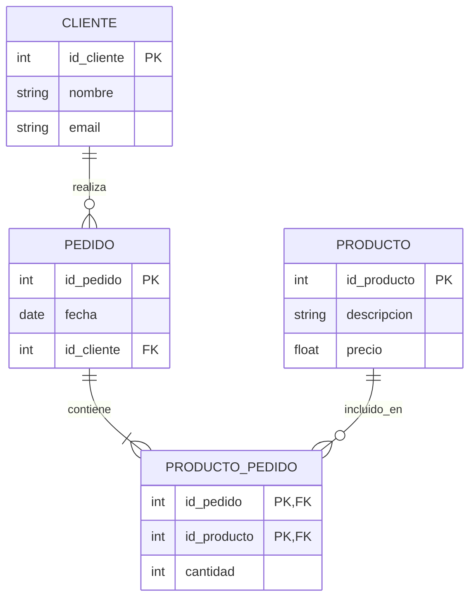

# Unidad 7: Modelado de Datos

En esta unidad abordaremos cómo estructurar y organizar la información dentro de un sistema, partiendo desde un diseño conceptual hasta llegar a un diseño lógico normalizado y listo para ser implementado en una base de datos.

---

## a) Diagrama Entidad-Relación (DER)

El Modelo Entidad-Relación (DER) es una herramienta de modelado conceptual que permite representar gráficamente la estructura de los datos de una organización y cómo estos interactúan entre sí.

### Componentes del modelo

- **Entidades:** Representan objetos, personas o conceptos del mundo real sobre los cuales el sistema necesita guardar información (por ejemplo: `Cliente`, `Producto`, `Factura`). Se suelen graficar con rectángulos.
- **Atributos:** Son las propiedades o características que describen a una entidad. Por ejemplo, la entidad `Cliente` podría tener los atributos `DNI`, `Nombre` y `Teléfono`. Se representan típicamente con elipses.
  - **Clave Primaria (PK):** Es un atributo o conjunto de atributos que identifica de manera única a cada instancia de la entidad (ej: `DNI` para un cliente).
- **Relaciones:** Definen la asociación o interacción entre dos o más entidades (por ejemplo: un `Cliente` *realiza* un `Pedido`). Se representan mediante rombos.
- **Cardinalidad:** Indica el número de instancias de una entidad que pueden asociarse con instancias de otra entidad a través de una relación. Las más comunes son:
  - Uno a Uno (1:1)
  - Uno a Muchos (1:N)
  - Muchos a Muchos (N:M)

---

## b) Modelo Relacional Básico

Una vez definido el modelo conceptual (DER), el siguiente paso en el diseño de sistemas es traducirlo a un diseño lógico. El **Modelo Relacional** es el enfoque más utilizado y es la base de las bases de datos relacionales modernas (SQL).

### Transformación del DER

El proceso de conversión del DER al Modelo Relacional sigue reglas precisas:
- Cada **Entidad** se transforma en una **Tabla** (o Relación).
- Cada **Atributo** de la entidad se convierte en una **Columna** (o Campo) de la tabla.
- Cada instancia o registro de la entidad se convierte en una **Fila** (o Tupla).

### Tablas y Relaciones entre tablas

En el modelo relacional, las asociaciones no se grafican con líneas simplemente, sino que se implementan mediante el uso de claves foráneas:
- **Relaciones 1:N:** Se implementan tomando la Clave Primaria de la tabla del lado "1" y colocándola como **Clave Foránea (FK)** en la tabla del lado "Muchos (N)".
- **Relaciones N:M:** El modelo relacional no soporta relaciones de muchos a muchos directamente. Para resolverlo, se debe crear una **Tabla Intermedia** (o asociativa) que contenga, como mínimo, las claves primarias de las dos tablas que se están relacionando.

---

## c) Normalización hasta 3FN

La normalización es un proceso sistemático mediante el cual se revisa la estructura de las tablas creadas para minimizar la redundancia y evitar problemas (anomalías) al momento de insertar, actualizar o borrar datos.

### Eliminación de redundancias

El objetivo de la normalización es asegurar que "cada dato no clave se almacene en un solo lugar". Esto garantiza la consistencia de la información y optimiza el almacenamiento.

### Tercera Forma Normal (3FN)

El proceso de normalización se realiza por etapas o "Formas Normales". En el alcance de la materia llegaremos hasta la Tercera Forma Normal (3FN):

1. **Primera Forma Normal (1FN):**
   - Asegura la atomicidad: Todos los atributos deben ser indivisibles.
   - Elimina los grupos repetitivos o atributos multivaluados (no puede haber una columna que guarde una lista de valores separados por comas).

2. **Segunda Forma Normal (2FN):**
   - La tabla debe estar en 1FN.
   - Todos los atributos no clave deben depender por completo de la Clave Primaria. Si la tabla tiene una clave primaria compuesta, ningún atributo puede depender de solo una parte de esa clave.

3. **Tercera Forma Normal (3FN):**
   - La tabla debe estar en 2FN.
   - **No deben existir dependencias transitivas.** Esto significa que un atributo no clave no puede depender de otro atributo no clave. Todo campo debe depender exclusivamente de la clave primaria.

> **💡 Regla práctica:** Para que una tabla esté normalizada en 3FN, cada atributo debe depender *"de la clave, de toda la clave y de nada más que de la clave"*.

---

## d) Ejemplo

A continuación, se presenta un Modelo Entidad-Relación (DER) diseñado con sintaxis Mermaid. Este ejemplo ilustra los conceptos de Entidades, Atributos, Relaciones y cómo se resuelven las cardinalidades utilizando Claves Primarias (PK) y Foráneas (FK).

### Análisis del Ejemplo:

1. **Relación 1:N (Uno a Muchos):** 
   - Un `CLIENTE` puede realizar varios `PEDIDO`s, pero un pedido pertenece a un solo cliente. 
   - **Solución Relacional:** La clave primaria `id_cliente` pasa como Clave Foránea (FK) a la tabla `PEDIDO`.
2. **Relación N:M (Muchos a Muchos):** 
   - Un `PEDIDO` puede tener varios `PRODUCTO`s, y un `PRODUCTO` puede estar en varios `PEDIDO`s.
   - **Solución Relacional:** Se crea la tabla intermedia `PRODUCTO_PEDIDO`. Esta tabla asocia ambas entidades y tiene una clave primaria compuesta por las claves de las tablas originales (`id_pedido` y `id_producto`), que también actúan como claves foráneas. Además, almacena atributos propios de la relación, como la `cantidad`.
